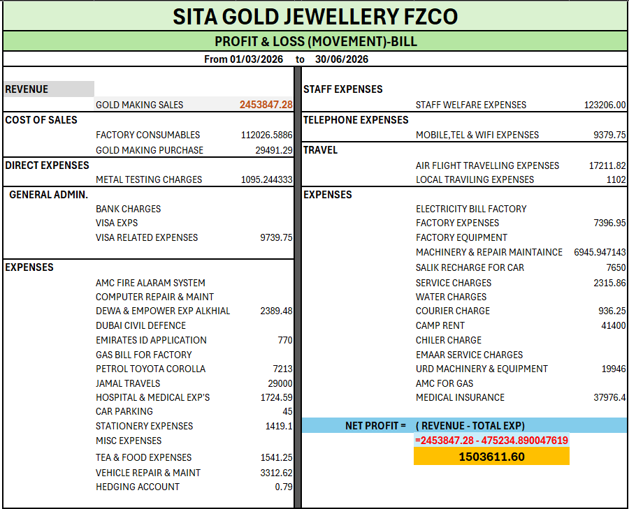

# Dynamic-Business-Reporting-Pipeline

This repository features a complete, highly advanced enterprise business intelligence and financial reporting system. Engineered around a robust automation core, this pipeline seamlessly consolidates comprehensive income tracking, detailed operational expenses, and regulatory compliances into a centralized database. Power-packed with cutting-edge VBA engines and dynamic indexing formulas, the system eliminates administrative overhead by driving an automated, executive-ready Profit & Loss dashboard alongside self-morphing multi-conditional data search environments.

---

##  Core Artifact & Database Modules

###  Direct Implementation Access
*    **[Download Complete System Core (`COMPLETE BUSINESS DUMMY DATA.xlsm`)](./COMPLETE%20BUSINESS%20DUMMY%20DATA.xlsm)** — *Access the full multi-layered data infrastructure, macro modules, and analytical frameworks.*

###  Comprehensive Sheet-by-Sheet Architecture

1.  **Daily Transactions (With Bill)**
    *   Acts as the primary, compliant accounting ledger capturing comprehensive customer profiles. It dynamically tracks structured transactional variables including tax/VAT computations, granular gold sales and purchase metrics, realized financial receipts, operational disbursements, outstanding balances, metal settlement flows, and sales returns under a strict unified table structure.
2.  **Daily Transactions (Without Bill)**
    *   Engineered as an exact functional mirror of the primary ledger to manage alternative internal pipelines and asset logs. This ensures complete system data capture and inventory balancing across the enterprise without merging disparate data streams or compromising regulatory compliance records.
3.  **All Income & Expenses Log**
    *   A centralized data ingestion log managing all corporate cash outlays and capital expenditures. Every operational transaction is explicitly structured with distinct predefined categories alongside isolated VAT segregation matrices to allow effortless data querying and tax reconciliation.
4.  **Consolidated Pivot Engine (Pivot Sheet)**
    *   The computational matrix backbone of the workbook. It systematically ingests raw, granular records from the Transaction logs and Expense ledgers, executing real-time aggregations and transforming row-level rows into multi-dimensional summary arrays.
5.  **Automated Dashboard (P&L Front-End)**
    *   The interactive presentation layer of the pipeline. It maps directly into the underlying Pivot engines to instantly display core performance indicators, automated billing summaries, and macro-level financial trends.

###  Intelligently Programmed Search Environments
*   **Expense Search Room:** Driven by dynamic array indexing logic, inputting a specific payment method or transactional type instantly fetches and populates all matching operational expenses.
*   **Dynamic Search Rooms (With Bill & Without Bill):** A highly sophisticated user interface powered by structural cell event listeners over cell `A3`:
    *   *Symmetric Header-Swap Transformation:* When a user types a `Customer Name` in cell A3, the sheet serves as a client-centric historical lookup. 
    *   *Automated Metamorphosis:* The moment the value in cell `A3` is changed to a business `Category`, the programmatic header mapping logic immediately detects the adjustment. The column headers instantly transpose positions—dynamically shifting columns, rewriting boundary lookups, and re-routing formulas in real-time based strictly on what is being searched.

---

##  Executive Visualizations

###  Profit & Loss Control Center

*This is an automatically generated Profit & Loss Dashboard displaying real-time financial tracking and dynamic operational summaries.*

---

##  Programmatic VBA Code Repositories

Below are the standalone source scripts running the underlying event listeners and dynamic index filtration architectures of the data discovery environments:

*   🔗 **[VBA Source Code: Expense Room](./VBA_CODE_FOR_EXPENSES_SEARCH_ROOM.txt)** — *This is the production VBA code governing multi-conditional query extraction for independent expense analysis.*
*   🔗 **[VBA Source Code: Billed Search Room Matrix](./VBA_CODE_FOR_WITH_WITH_BILL_SEARCH_ROOM.txt)** — *This is the production VBA code managing dynamic index references and automatic column header transformations for compliant transaction pipelines.*
*   🔗 **[VBA Source Code: Non-Billed Search Room Matrix](./VBA_CODE_FOR_WITHOUT_BILL_SEARCH_ROOM.txt)** — *This is the production VBA code regulating parallel search matrices to maintain dynamic querying without affecting tax compliance schemas.*
